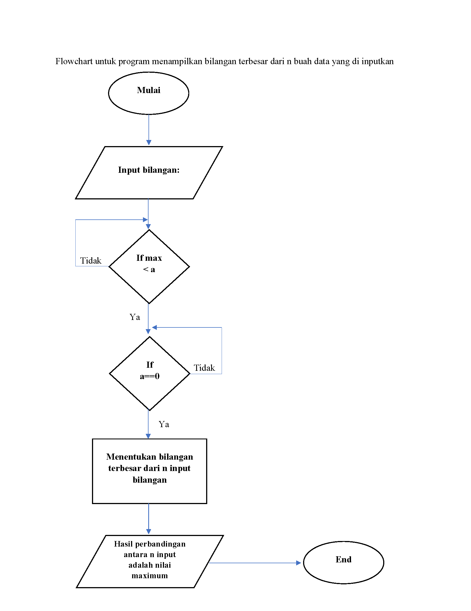

# labpy3
## latihan 1
berikut adalah flowchart yang digunakan dan diaplikasikan kedalam codingan

codingan

hasilnya

### latihan 2
berikut flowchart yang di gunakan dan diaplikasikan kedalam codingan

codingan
ditambahkan perintah break sebagai penghenti

hasilnya

#### program 1
berikut adalah flowchart yang digunakan dan diaplikasikan kedalam codingan

cofingan

hasilnya
